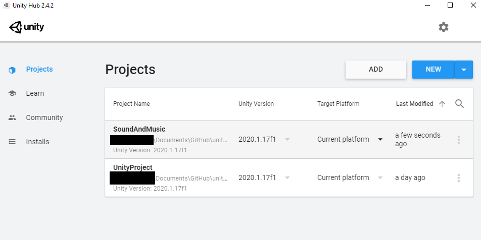
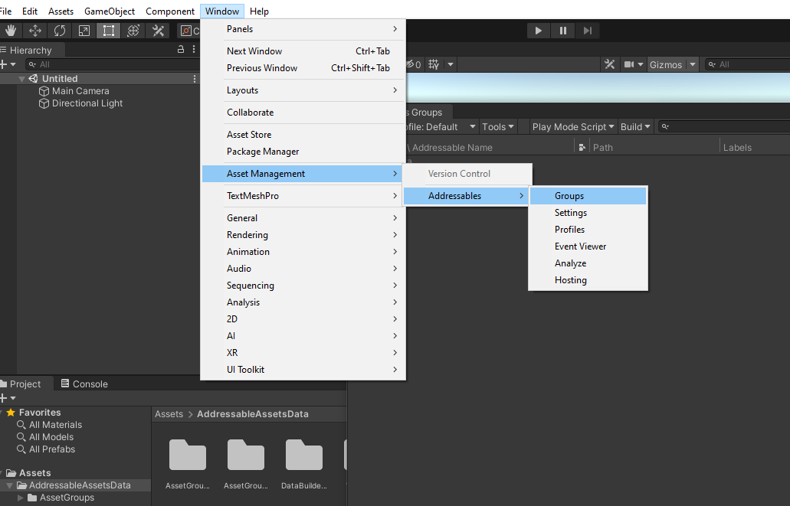
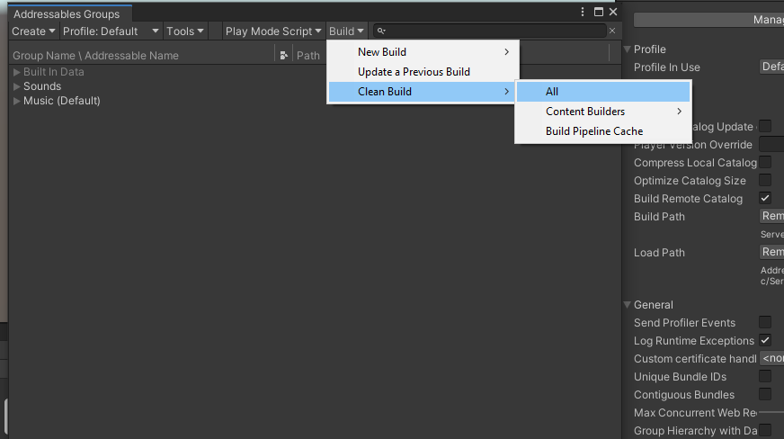
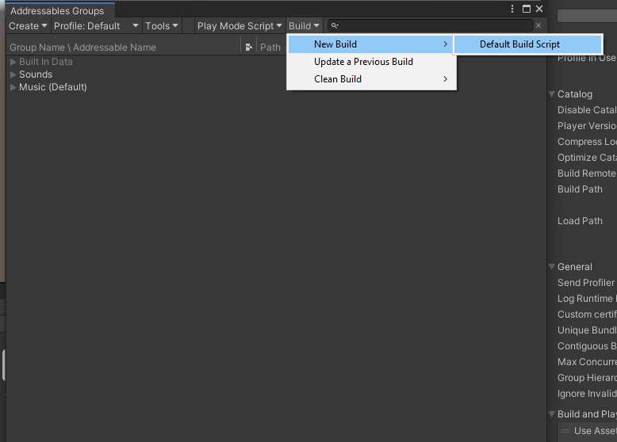

# Overview of Addressable Sounds

To save on the file download for the client, sounds for UnityStation have been moved to a separate Unity project within the existing Github repo. This is made possible by utilising Unity’s addressable library which you can read more about here (https://docs.unity3d.com/Manual/com.unity.addressables.html)

 This project (**SoundAndMusic**) allows you to assign a sound file to a field of a particular component by making a corresponding prefab which is then referenced inside the usual Unity Project. When you build the SoundAndMusic, the project will produce two files, a hash file and a json file with data. Uploading these to a CDN allows the main game to read the catalogue that you uploaded and recreates the files on your computer when you open up an executable.

## How to Make a New Sound


 Add a new Unity Project by going into UnityHub and clicking “Add”. Navigate to the **UnityProject -> AddressablePackingProjects -> SoundAndMusic**.


Once the SoundAndMusic Project is open, put your audio file into the appropriate “Audio” subfolder and create a prefab inside the “Prefab” folder with the same name. Your new sound prefab will not be included in the Addressable build in the main project unless you build a new one. To make a new build follow these steps.

​    1. Click Window on the top bar, select Asset Management -> Addressable




​    2. Go Build -> Clean Build -> All. This will remove the old build from the ServerData Folder.



​     3. Click Build -> New Build -> Default Build Script




After doing this and closing the SoundAndMusic Project, the new Build is ready to imported. When you next open UnityProject, you will now be able to add in your new prefab. You will be able to make any object play the sound effect by ensuring that the following line is within the particular script of a component you want to play the sound.

```cs [SerializeField] private AddressableAudioSource clickSound = null; ```

 Or if you want to play from a list of sounds, declare instead ```cs ‘’’ List<AddressableAudioSource>’’’.```

Once declared you can either play the sound by calling it in the script using the ```cs PlayNetworkedAtPos() ``` function or in the editor type out the name of the sound you want to play in the relevant component like so:


That's it!