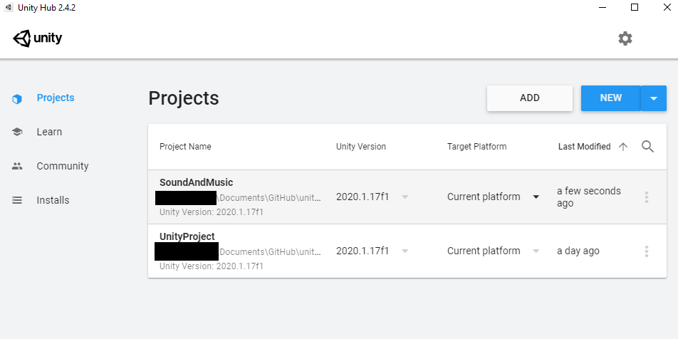
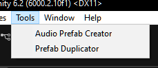
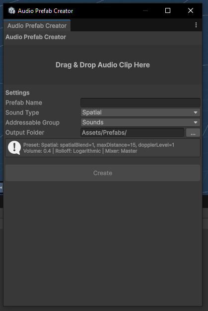

# How to add new sounds to the game

To save on the file download for the client, sounds for UnityStation have been moved to a separate Unity project within the existing Github repo. This is made possible by utilising Unity’s addressable library which you can read more about here (https://docs.unity3d.com/Manual/com.unity.addressables.html)

 This project (**SoundAndMusic**) allows you to assign a sound file to a field of a particular component by making a corresponding prefab which is then referenced inside the usual Unity Project. When you build the SoundAndMusic, the project will produce two files, a hash file and a json file with data. Uploading these to a CDN allows the main game to read the catalogue that you uploaded and recreates the files on your computer when you open up an executable.

## The SoundAndMusic Project



Add a new Unity Project by going into UnityHub and clicking “Add”. Navigate to the **UnityProject -> AddressablePackingProjects -> SoundAndMusic**.

## How to Make a New Sound

You already have the audio files you want to import, right? Cool, so now navigate to the **Audio Files directory**


See if any of the folders is a good category for your sound, otherwise create a new one.

Then direct your attention to the top bar, and go into **Tools -> Audio Prefab Creator**



Here you will see a little form with fields for you to fill. Let me explain each one, but they should be pretty self-explanatory.


- Drop an audio file from the project view into the drag and drop area.
- The settings for the result prefab will be automatically set for you, you just need to fill a couple fields.
- **Prefab Name**: will be autopopulated from the audio file, but you can choose your own name (and we encourage that you do. Please follow **PascalCase** naming.)
- **Sound Type**: is there so you can pick from spatial or global sound. We suggest that you always keep it spatial, that way we can make it global or spatial using code in the main project.
- **Addressable Group**: is this sound a sound effect or music? Pick the group here.
- **Output Folder**: choose a folder for the result prefab. Like audio files, see if there is any category that matches your sound or create a new folder.

And that's it. Shrimple as.


## Making a new build of the addressables project


Now it is time to create the bundle that includes your new sounds. Your new sound prefab will not be included in the Addressable build in the main project unless you build a new one. To make a new build go to **Tools -> Addressables -> Clean Build and Deploy**. This will:

1. Clean the old build from the ServerData folder
2. Build the new addressable bundles
3. Deploy the build to the `AddressableContent/` folder at the repo root
4. Update the catalogue JSON with the correct GitHub CDN URLs

After doing this and closing the SoundAndMusic Project, the new Build is ready to be imported. When you next open UnityProject, you will now be able to add in your new prefab. You will be able to make any object play the sound effect by ensuring that the following line is within the particular script of a component you want to play the sound.

```cs [SerializeField] private AddressableAudioSource clickSound = null; ```

 Or if you want to play from a list of sounds, declare instead ```cs ‘’’ List<AddressableAudioSource>’’’.```

Once declared you can either play the sound by calling it in the script using the ```cs PlayNetworkedAtPos() ``` function or in the editor type out the name of the sound you want to play in the relevant component like so:


That's it!