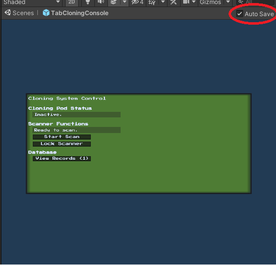
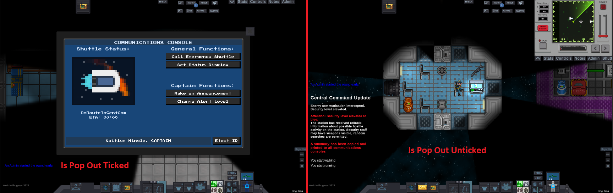
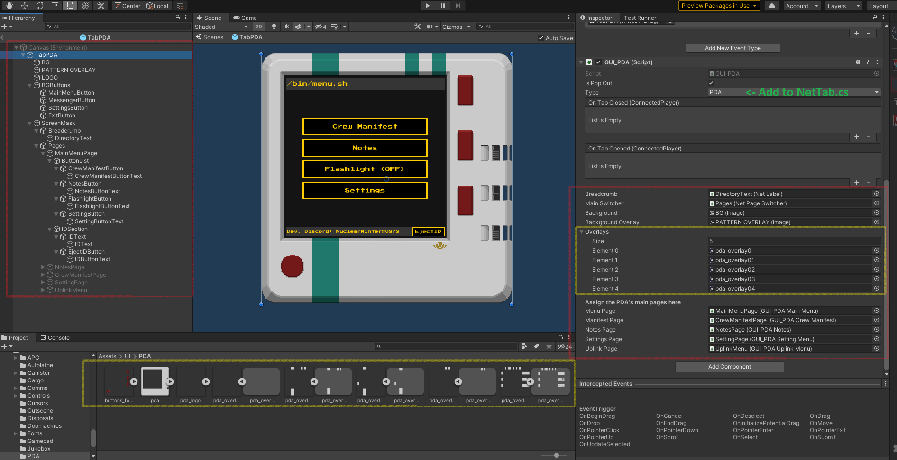

# How To Create a User Interface

## Getting Started

In order to create a User Interface for UnityStation, first open the Unity Editor. You will need to save at least one of each file types, the UI Prefab, the GUI script and the backend script. Each type file needs to be saved in a different place. If there is more then one file of the same type, please create a subfolder to group them together. Note that some of the UI Prefabs are located in UnityProject\Assets\Resources\UI\GUI, they will be moved from this location in the future, do not try to add UI Prefabs here unless you really have to. Feel free to copy and use the resources in this folder for your UI if you need a placeholder.

### UI Prefab files

#### Overview

These files are stored in **UnityProject\Assets\Prefabs\UI** and is what the player will see. There are currently three folders, **ingame** (contains all the incidental UI HUD details, inventory slots etc.), **RightClick** (contains all the assets for the right click item select menu) and **Tabs** (This is the one you will want to put your UI menu into).

#### Tips

Make sure to **tick to disable auto save**  when you open this prefab to modify the placement of elements, otherwise Unity will attempt to save the layout everytime you touch an element on this prefab.

When building your UI in the editor, it is good to group each menu of the UI into a NetPageSwitcher, you don't have to have one. It is possible to nest NetPageSwitchers if a menu requires submenus.

### GUI Scripts

#### Overview

These files are stored in **UnityProject\Assets\Scripts\UI** this file is what runs the UI's code, there are four folders, **Core**  (contains the scripts which makes the UI possible), **Items** (contains the UI for items that a player can interact with, such as the PDA, Scroll, SpellBook etc.), **Objects** (contains the UI which is displayed on Consoles and Vendors, divided up into the relevant department - e.g. Security folder contains the SecurityRecordsConsole subfolder, which in turn has the GUI_SecuirtyRecords.cs and other related GUI scripts) and **Systems** (contains admin panels, character character screen, lobby screen, etc.)

#### Tips

Copy an existing UI script and attach to your copied Tab object via the inspector, shown on the right below in the PDA screenshot. Make sure to clearly and distinctly label all objects in your TabNAME, particularly NetPages to avoid confusion and they are the child of ScreenMask - this object hides the pages so only one can show at a time.

##### IsPopOut

This next section will explain the GUI script, going from the top of the GUI script component in the inspector. IsPopOut checkbox if ticked, will not be anchored to the top right menu, instead it will be a standalone menu occupying the centre of your screen.

##### Type

Type is important as this enumerical used to bring up the UI from the object/item/system etc. Add your new UI's name and number into the list inside *NetTab.cs* and select it in your GUI script.

##### NetObjects

Make sure you reference the necessary objects from the hierarchy into your GUI_NAME script so they can be called (**red box**). If you want your UI to change it's appearance depending on a player/item attribute it is best to store them as separate 2D Textures so they can be tailored (**yellow box**). Doing this allows you to reference them in your code and be able to manipulate them using your backend script.

One of the most important functions to include in your GUI_Script is an *UpdateDisplay()* function, this function should update the UI by calling *SetValueServer* for all necessary UI elements.  For regular menus switching can be handled by attaching the <function name> to a NetButton, however *.SetActivePage()* function will allow you to switch between your submenus in your code so long as you make a variable stating it is a *NestedSwitcher*. **Your class from the backend script should also be stored as a variable inside GUI_NAME as well so you can call it.**

### Backend

#### Overview

These files are stored in **UnityProject\Assets\Scripts** this file contains any backend code that does not directly dictate what the UI does, but manages all other components. Place these scripts inside the corresponding folder so it matches where you put the GUI Script, so Scripts\Core for Scripts\UI\Core and so on. The player-to-item or player-to-object interaction step is not handled in the manager script as it is treated as external to the UI. Create the script inside either Core, Items, Objects, etc. in **UnityProject\Assets\Scripts**, call a public GUI class inside it if modifications through items to the object are required, block out all unnecessary trait with the WillInteract function, etc.. Attach this component to the object on that will be on the map.

#### Tips 

To be expanded. Include AddListener() and explain that all Server, Validations and Inventory functions should appear here. Adding #region will help a lot in remembering what section does what.

## NetUI Elements

This subsection will be describing NetUI elements and how to use them.

### Important stuff

1. `NetTab` stores all `NetUIElement` at the start in the dictionary; because of that, we can use `netTab["elementName"]` to get reference to elements. However, it gives us a restriction - all `NetUIElement` must have unique names in current tab. If you have two `NetLabel` named "text" as children of `NetTab` gameobject - you will get duplicate dictionary key error.
2. `NetUIElement` has two methods for setting value - `Value` and `SetValue`. The only difference is that `SetValue` calls net update immediately.
    
   If you don't understand how to use a particular component - check examples to see how they are used in existing UI.
   If you still can't understand something - be sure to ask on Discord.

### NetworkTabTrigger

`NetworkTabTrigger` is a class that allows you to open UI window on player Interaction. The class is abstract, so you will have to inherit it.
Usage:

1. Put an inherited `NetworkTabTrigger` component on item in scene that will open your UI.
2. Set NetTabType in inspector so it opens correct window on interaction.
   Examples:
   Just check classes that inherit `NetworkTabTrigger` - `APCInteract`, `CargoConsole`, `NukeInteract`, etc.

### NetLabel

NetLabel is used to sync Text component between clients.
Usage:

1. Add `NetLabel` to gameobject with `Text` component.
2. When you need to change the text, server should run `netLabel.SetValue = "message";`. This will update text component on all clients.
   Examples:
   NetLabel is very simple and straight forward, but if you need to see examples of usage - check out `GUI_APC` or `GUI_Spawner`.

### NetColorChanger

NetColorChanger syncs color of any `Graphic` element (i.e `Image`). Takes color hex value as a string.
Usage:

1. Add `NetColorChanger` to gameobject with `Graphic` component.
2. When you need to change color, server should run `netColorChanger.SetValue = "ffffff";` where `ffffff` is new hex color.
   Examples:
   Current `GUI_APC` makes heavy usage of that component, `GUI_CargoPageStatus` contains NetColorChanger as well.

### NetButton

NetButton is a component that lets the client call a function on the server when interacting with the Button component locally.
   
   Usage:

1. Add `NetButton` to gameobject with `Button` component.
2. Change button's `OnClick()` to `NetButton.ExecuteClient`.
3. Change netButton's `ServerMethod()` to method you wish to call as a server.
   In the end, it should look like that:  
     
   Examples:
   `TabCargo` prefab has lots of buttons with `NetButton` component.
   
   Note : `NetToggle` is setup and works exactly like this. 

### NetPages

NetPages is a concept of making UI in several pages instead of one ([cargo console](https://www.youtube.com/watch?v=fFuLGzgH9Ck)). It is done by switching on/off gameobjects that represent sub-page in one window. The structure looks like this: 
 
Where current tab's gameobject will be enabled and all others disabled.

Usage:

1. Structure your gameobjects like on screenshot above. NetTab is your main window with `NetTab` component.
2. Put `NetPageSwitcher` on NetPages gameobject. Here you can set pages and default one, if you dont set them - it will be done at the `Init()`
3. Put `NetPage` component on all of your subpages. You can inherit this class if you wish to make some page-specific code.
   To switch between pages, you will need to call `SetActivePage(NetPage)`, `NextPage()` or `PreviousPage()` methods of your `NetPageSwitcher`
   Examples:
   `GUI_Spawner` and `GUI_Cargo` both use NetPages.

### Dynamic Lists

Dynamics lists are net synced lists of gameobjects.
For now, there are two types of dynamic lists - `ItemList` which stores prefabs (not actual instances) and `SpawnedObjectList`that contains objects that are spawned ingame.
Usage:

1. Add `SpawnedObjectList` to gameobject that will act as a holder to list elements.
2. Set its EntryPrefab in the editor. If you won't set it, it will try to Resource.Load gameobject with name `%NetTabType%Entry` (i.e. CargoEntry).
3. Use `AddObjects(List<GameObject>)` to populate the list with items you need.  
   If you need to access entry, you can do `TypeYouNeed entry = myDynamicList.Entries[i] as TypeYouNeed`
   Examples:
   `GUI_Spawner` which uses `ItemList`.  
   Cargo uses inherited class - `GUI_CargoItemList`. You can see usages of it in `GUI_CargoPageSupplies` and `GUI_CargoPageCart`.
