# How to Map

This page explains the details of how to do mapping within unitystation.

All mapping is done in Unity.

### Setting Up Your Workspace
You should have the following windows open. To open a window, to the __Window__ tab at the top of Unity.

<ul>
    <li>Window > General > <b>Scene</b></li>
    <li>Window > General > <b>Project</b></li>
    <li>Window > General > <b>Hierarchy</b></li>
    <li>Window > General > <b>Inspector</b></li>
    <li>Window > <b>Sidebar</b></li>
</ul>

### Introduction to Scenes
Unity uses [scenes](https://docs.unity3d.com/Manual/CreatingScenes.html) to define environments and menus. Let's look at one.

<ol>
<li>Open an existing scene: UnityProject > Assets > Scenes > Mainstations > TestStation</li>
<li>Make sure you have your Scene window focused</li>
<li> Look around the Scene with the <a href="https://docs.unity3d.com/Manual/SceneViewNavigation.html">Hand Tool</a>. To move prefabs around the Scene, use the <a href="https://docs.unity3d.com/Manual/SceneViewNavigation.html">Move Tool</a></li>
</ol>
Notice that in the Hierarchy window selecting _TestStation_ selects the entire station, but not other shuttles, etc.
You can save maps and areas as [prefabs](https://docs.unity3d.com/Manual/Prefabs.html) by dragging them from the Hierarchy tab into the Project tab.

## Getting Started
The processing of mapping depending on what type of scene you are mapping. In UnityStation, scenes are divided into the following scriptable objects:

Main Stations – where all the crew spawns at the start of the round

Away Sites – on the MainStation there is a portal which connects to one of these scenes which the player then jumps through when the connection is established in the middle of the round.

Additional Scenes – the scenes which the antagonists start on.

Here is a handy diagram which you can use if you want to add a new antagonist or job and ensure that it updates across all the scenes.
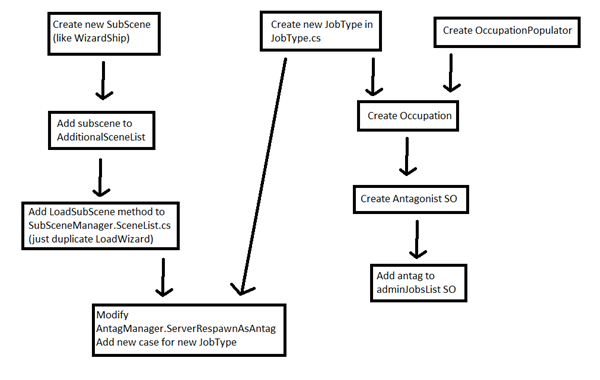

## Important Sidebar Functions
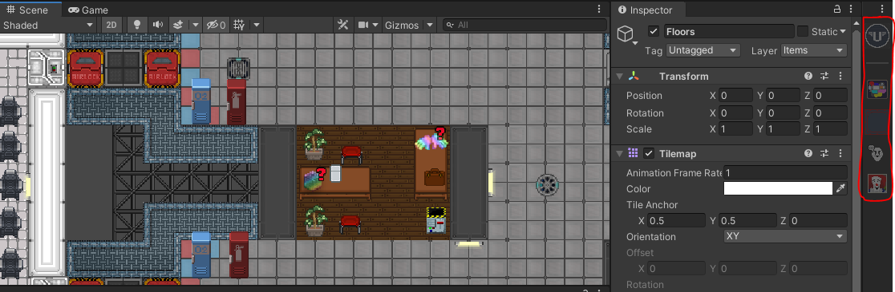
When you open the editor, there should be a sidebar open on the right hand side of your screen. If it is not present, go Window -> Sidebar to make it appear. This sidebar will help you through some of the processes as you map. From Top to Bottom they are:

### Test Runner

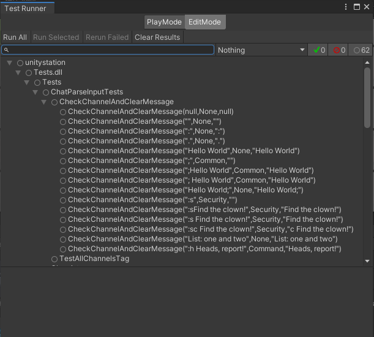

Performs a variety of tests to check for Null references and other things. These tests are also used when you send a Pull Request. To run these tests, click __Run All__ and then leave it for a while, it is not a quick process (use this opportunity to get something to eat/drink or some other professional/recreational activity of your choice).

Errors will be denoted by a red cross, click on the individual test which has a red cross and read the error that appears in the bottom box to fix up the Scene. Be sure to click __Rerun Failed__ to see if you now pass these tests.

### Tile Palette

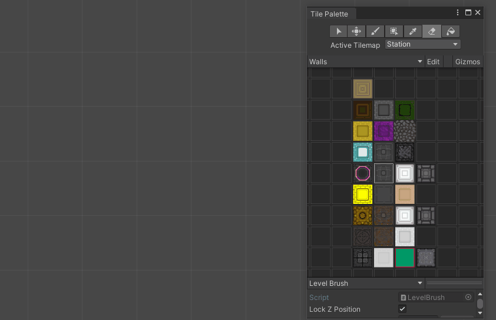

- The Tile Palette tab lets you place walls, floors, doors, tables etc. into the Scene tab
- Make sure to select the right Active Tilemap in the Tile Palette when editing
- The new tiles and objects will be added to the right categories within the active tilemap automatically

Keep in mind when editing a Tile Palette that tiles are added to the palettes as they are created. To create a new Tile follow this example:
- Choose a tile from /Tilemaps/Tiles/Objects
- Drag a tile to a palette

### Matrix Check

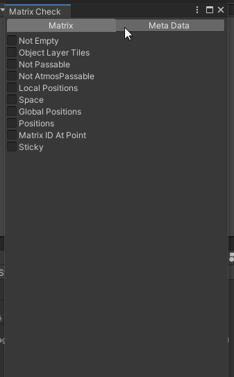

This tool allows you to check out atmospherics details when you run the executable in the editor (temperature, pressure, etc. on each tile). Good for making sure you haven’t left a gap somewhere, _make sure that you have __Gizmos__ enabled_.

### LogLevels
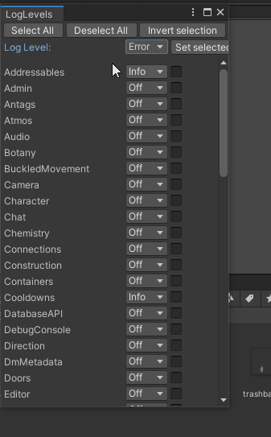

Monitors certain variables when you are in play mode editor, displays them in the __Console__ tab if they aren't set to _Off_. Useful for debugging your map.

### PixelArt Editor
Not necessary for mapping purposes.

## Creating a MainStation Map

### Part 1 - Populating Underfloor And Electrical Items

!!! Tip
    Before you hook up your lights and light switches, be sure to read the Map Tips at the bottom to familiarise and it make it easier for yourself.

#### Electrical

1.	Copy and paste the TestStation Scene inside Asset/Scenes Folder, do not have Unity open when you do this. Be sure to relabel the TestStation Matrix!!!
2.	Go to the tab `Mapping` at the top bar and then click the button `Set all sceneids to 0`, this is needed to reset networking id's
4.	Delete all the objects in the Object Layer of the MainStation, then open up the Tile Palette, erase all the tiles, select base floors and begin the process of painting the tiles to make up the Station.
5.	Next you will want to designate where the departments should go and how big they should be. Move the spawn points to generally mark out the areas so you can keep track of where everything is going. How you approach the rest is up to you, Part 2 and 3 below is a suggested method for you to use if you wish.
Consider then mapping in all the power cables, atmos pipes and disposal pipes. This is all the important life support stuff that makes the station function. This step can be done at any time, however, a lot of **LighTubeFixtures**, **LightBulbFixtures**, **AirVents**, **Scrubbers**, **Pumps**, **Mixers**, **GasConnectors**, **Filters**, **UnaryVents**, **Metres** and **DisposalBins** prefabs are required for the station to run. See Part 2 step 2 for details on how to add existing prefabs onto a Scene.

UnityStation’s Electrical Wiring differs from base SS13. Follow the guide below to make sure you correctly hook everything up.
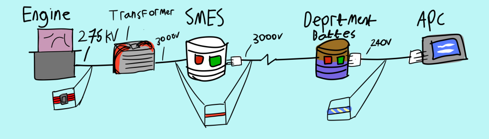
Make sure to always put a machine connector (white square in diagram) on the lower voltage side of the device. If you are still stuck, consult the wiring on TestStation Scene in the Electrical Testing Area and inspect the relevant prefabs.

!!! Tip
    It is strongly encouraged to avoid mapping underfloor utilities (wires, atmos / disposal pipes) under walls, windows. While mapping more than one type of underfloor utilities on one tile is currently annoying in that they aren't yet layered correctly for rendering, doing this will allow players who are playing the engineer role the ability to debug the wire pathways to find a fault without ever having to deconstruct a wall or window in the way. If it is unavoidable, that's ok, but don't make a habit of it.

#### Atmospherics

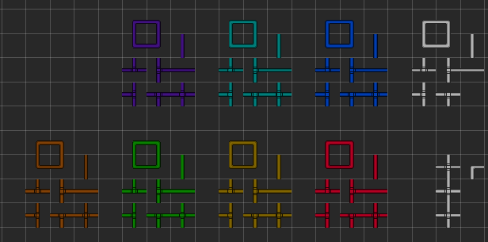

The **atmos pipes** are colour coded to help keep track of a specific function, use the following convention:

* Silver/Purple Pipes – These pipes are the internal pipes for the department which connect up to GasConnectors, these connectors allow an atmos tech to pump gas into/out of a gas canister into the pipes.
* Light Blue – These pipes connect up the canisters of nitrogen and oxygen that everyone will be breathing. They replace the yellow pipes for the air canister and connect directly to the blue pipes.
* Blue – Exports Gas out into the Station to the AirVents
* Red – Imports Gas back into the Atmospherics Department from the Scrubbers
* Green – Connects to Red Pipes has Filter prefabs littered through is section to filter out each gas to its specific canister chamber
* Orange/Yellow – Connects to pumps to pump out gas from a particular gas chamber, yellow pipes connect up to the end of the Green and Blue pipes

The atmos prefabs have been laid out so you do not need to tinker too much with them, be sure to select the right one for the job. Here is a general guide to explain what prefab does what.

* **GasFlowMeter** to be attached to pipes inside the atmos department, **GasFlowMeterAtmosWasteLoop** to attach to red pipes outside of the atmos department and **GasFlowMeterDistrubutionLoop** to attach to blue pipes outside of the atmos department
* **GasFilter(GAS-NAME)** and **GasFilter(GAS-NAME)Flipped** are filter prefabs which sit on an empty tile connected to tiled pipes. They filter a particular gas out, usually into a designated atmos room.
* **GasMixerAirMixer**, **GasMixerOff**, **GasMixerOffFlipped**, **GasMixerOn**, **GasMixerOnFlipped** are mixer prefabs which mixes two gases together in a particular proportion. The "Air" that the crew breathes on the station has been deliberately set in the AirMixer, make sure you use that one in the department.
* **GasPumpOn**, **GasPumpOff** are the pump prefabs which are set to be on and off when the round starts.

**ACUs** (air alarms) allow atmospheric technicians to control the local room's atmopshere, but they're useful to everyone as it allows you to quickly gauge a room's atmospheric state. ACUs should be as similarly common as APCs. Consider placing these in high-traffic areas where they're easily observed. Any connected ACU device (scrubbers, vents) can act as a sensor for the ACU, optionally including the tile in front of the unit itself. If the ACU is not directly in the room that it monitors, such as SM core, server room or (at least temporarily, until we have atmospheric tank control consoles) atmospheric tanks, then be sure to turn off `Acu Samples Air` in the `AirController` component so as not to skew the monitoring. There are several AirController presets designed for particular rooms in mind, like cold rooms, server rooms etc - be sure to take a look for special usages.

#### Disposals

The **Disposal System** is straightforward to map in if do the following steps. Be sure to connect the  **ConveyorSwitch** prefab to the relevant **ConveyorBelt** prefabs.

1. Mark where you want your **DisposalBins** by click-and-dragging the prefab onto the scene, ensure that all bins are on the object layer when you are done placing them.
2. Designate the *Mail Room* in Cargo. Then add in a **DisposalOutlet** prefab connected a couple of **ConveyorBelt** prefabs leading to a **DisposalInlet** prefab.
3. Designate the *Disposals Room*, this room needs to be on the outer most part of the station to eject trash into space. In this Room you need a **DisposalOutlet** prefab connected up to a couple of **ConveyorBelt** prefabs leading to an opening in the wall to space, but stop one tile short. A **BlastDoor** prefab will over the opening and will have a **TinyFan** underneath. A **MassDriver** prefab will go inbetween the ConveyorBelt and the BlastDoor, it is responsible for launching the trash. Link up a **ButtonDoor** to operate the BlastDoor and a **ButtonMassDriver** to operate the MassDriver.
4. Open Tile Palette > Disposals and place one receiving pipe (the tile with the circle) underneath all the DisposalBins/DisposalInlets/DisposalOutlets, then map all the pipes taking care to orient all the pipes towards the Mail Room's DisposalOutlet. Then connect the Mail Room's DisposalInlet to the Disposals Room's DisposalOutlet.

### Part 2 - Placing Walls and Prefabs

To help with completing Part 3, click and drag all prefabs onto the scene, select them all in the Hierarchy and drag them into the Matrix’s Object layer when you feel you are finished.

1.	Add in the Walls to designate the rooms, relevant floor tiles and tables to populate the rooms. Remember that floor tiles are not present in maintenance areas, unless it is in a room coming from a corridor.
1.	To place objects into a scene search in the File manager with the prefab filter on, then click and drag the prefab onto the scene. All objects you place will need to go on the Station Matrix’s Object layer in the Hierarchy. (To avoid having to click and drag the list of prefabs into the object layer, highlight all the objects, click *cut* and then right click on the *Object Layer* and select **Paste as Child**). IMPORTANT: make sure you keep consistent unique number or attach an “_name” (e.g. APC_Kitchen), this will help a lot when you need to add in references to other prefabs, as you can tell them apart.

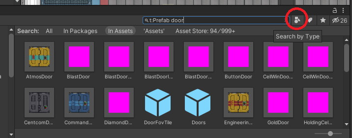

### Part 3 - Adding and linking in all the other Prefabs

1.	Add in all the other prefabs. Don’t worry if you aren’t getting the x,y co-ordinates close to the centre of a grid square, the Custom Net Transform always has Snap To Grid enabled, so it will have perfect co-ordinates in-game. If you like, you can also use the `Mapping > Snap to Grid All Applicable Objects` tool to ensure this before runtime.
1.	As you progress placing the objects down onto the matrix, make sure you modify the relevant fields on the prefabs so that they can be referred to by the other relevant prefabs. You can use the `Tools/Mapping/Device Linker` tool to assist in linking certain objects together, like APC devices to APCs.

Each device can also be linked via the controls on the relevant component. For example, on `APCPoweredDevice`.

    You can see that the selected Fire Alarm is connected to the APC and to three firelocks, the quantum pad is not connected to an APC and the console is not connected to some sort of device - these two need attention. 
 The best way to see what prefabs relate to what is to open an existing map and turn on gizmos. Make sure all of the gizmos are turned on and if a line exists between the prefab and another, then a relationship exists. As there are a multitude of components that can exist on a prefab, it is best to read through them to understand what they are doing and what they need, some have tooltips to help. Always remember you can look at existing maps to see how the prefabs are connected.
1.	All the shuttles need the reaction control system (RCS) Thrusters to be added onto the outside of the shuttle matrixes. Follow instructions detailed [here](https://github.com/unitystation/unitystation/pull/5111).
1.	Use the `Tools > Mapping > Name Validator` tool to ensure certain objects have appropriate names. 

## Asteroids and Ruins

Asteroids and ruins are different obstacles Shaft Miners, Curators or Assistants can stumble upon on their travels. Asteroids primarily serve as Ore Deposits for Shaft Miners, sometimes they also have exotic plants or mobs to fight as well. Ruins are derelict stations or shuttles for the players to explore. Copy an existing asteroid or ruin scene inside the **AsteroidScenes** Scene Folder to get started, **make sure you define the location of your scene to somewhere well away from (0,0) otherwise it will spawn inside the station.**

### Asteroid Tips

- If you want your asteroid to have exotic plant life, put in the **random dirt pile** prefab. The Potential Wild Plants list can be adjusted so whatever plant you want can spawn there.
- If you want your asteroid to have mobs for players to encounter, use the **RandomItemPool** prefab and in the Random Item Spot component increase the Pool List and select either CarpSpawner, Alien egg etc. from the list. 2%XenoEgg or the NPCs can also survive on an Asteroid too. **If you don't want your mobs to fly off your asteroid, make sure to enclose them in rock.**

### Ruin Tips

- You can wire up your ruin electrically as much as you want, make sure to use the damaged tiles and cracked windows in the Tile Palette to give it a really rundown feel.
- You may want to include some lore about why this ruin exists, if you put in a **Paper** prefab into the scene and select its Paper Component you can fill out its text field to your heart's content. A list of all available tags to stylise it can be found here ([Rich Text | Unity UI | 1.0.0 (unity3d.com)](https://docs.unity3d.com/Packages/com.unity.ugui@1.0/manual/StyledText.html).

## Shuttles

!!! warning
    Shuttle movement is not the best currently and an attempt is being made to rework it so that you can direct the movements in an component in the editor.

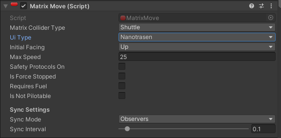

Currently the only way to make a shuttle is through the editor, no capabilities exist to build one using the in-game construction system. This is in part due to how the matrix bounds are set as shown in this section. A shuttle matrix's **red square** position is very important, much sure it is **in the middle of the shuttle** as this is the pivot used as the reference when the shuttle is being rotated to turn left/right. **UI Type** should be usually set to Nanotrasen, but should be set to Syndicate if it is a Nuke Operative shuttle. **Initial Facing** is also very important as this is how Unity will perceive the initial orientation of your shuttle.

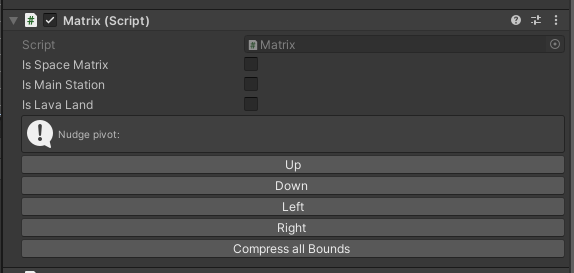

To extend the shuttle matrix out select the correct matrix in the Tile Palette Window and paint some tiles, as long as you have gizmos turned on, you should see the bounds snap to accommodate the new tiles. When you are happy with the shape click "Compress All Bounds". Again, the shuttle matrix does not have a directional component, so you will need to make sure you orientate your shuttle correctly and select the correct drop down menu option to reflect this orientation.

A shuttle should have the following prefabs to make it function:

- **Shuttle Console**, usually located at the front of the shuttle to pilot the matrix
- **CanisterPlasma** and a **Wrench** to provide the fuel and means to secure it
- **Shuttle fuel connector** which the canister will need to be wrenched down onto to power the shuttle
- **Shuttle Chairs** for pilot and passengers, as well as **Lighttubes** and **Doors**

There are two special shuttles which will need to have their co-ordinate set in these components located with the first layer of the hierarchy under the same name as their parent - the Escape shuttle and the Cargo Shuttle. *(Escape pods can be mapped in, but they will not function)*

The Cargo shuttle must not have any live animals on board and have shutters which link to a **door button** in the Cargo Loading Bay.

The Escape Shuttle must always have the following extra prefabs:

- An **EscapeShuttleConsole** for the antag objectives involving hijacking it
- At least three different areas, general access, command access and security access for prisoners

## Mapping Guidelines and Pointers
Objects should never be rotated using the Transform. Their local rotation should always be 0, 0, 0. If you change it, it will either not have any effect or may have unexpected consequences. If there is any need to rotate an object, define its facing, etc...it should be done via Directional or other components.

Various objects which already have directional facing logic, such as wallmounts and chairs, can have their direction set by adjusting Directional's Initial Direction field.

### Map Tips
Here are some general tips to help you get when mapping in UnityStation:
- Do not attempt to try and finish your map from scratch in one sitting, it is better if you break it down into sections.

- If you find yourself unable to place tiles from the Tile Palette and are receiving a ton of warnings, it may be because you are missing a layer in the matrix. Duplicate an existing layer in the matrix and perform the necessary changes before trying to place anymore tiles.

- Attaching an APC can be quite tedious, but can be made a lot easier if you place the APC first, relabel it and then attach the APCPoweredDevice by moving it close to the APC and hitting the Auto Connect Button.
  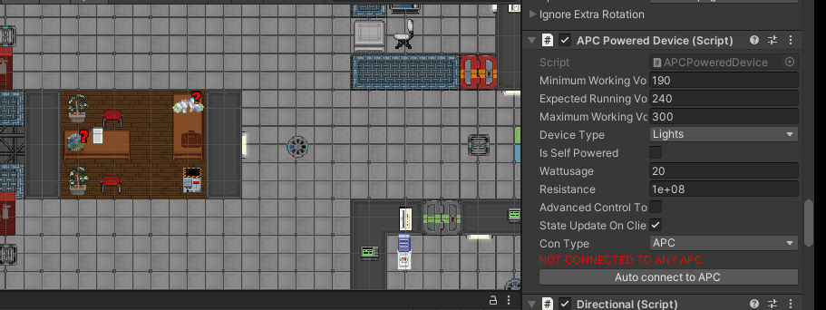

- If you have a lot of APCPowered Objects you need to connect, you can also connect them up by first turning on the *Gizmo* called *APCPoweredDevice* to show that the prefab is correctly disconnected and then scrolling through the APC prefab to find the **APC (script)** component and then click **Begin Selecting**. Remember to hit **Stop Selecting** when you are done, all the connections are listed in the Connected Devices in the same component, if you want to validate you have selected them all.

  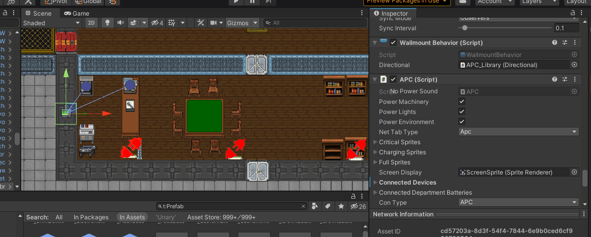

- Make sure for jobs that will have 2 or more signing up to them that you have placed multiple spawn points in the department – this ensures that players do not spawn ontop of each other. To do this, copy an existing spawn point inside the SpawnPointsV2 object, alter its position and spawn name.

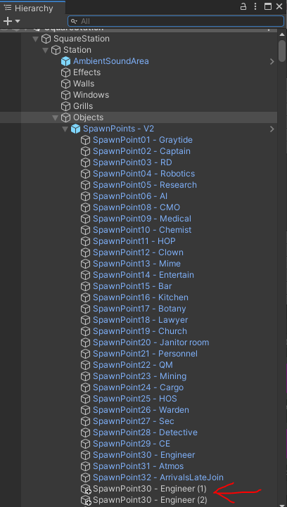

- So you can see what you are placing tile-wise on a particular layer, you can select obstructing layers to hide in the Hierarchy. You then can press the crossed-out eye above the scene view window to toggle the layers’ visibility.

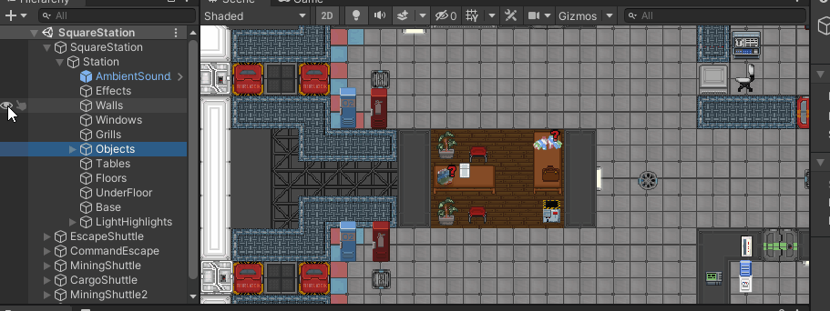

- Make sure you have put tiny fans on all the airlock exits into space on stations and shuttles to help stop space wind problems.
- Walk around as an assistant in Play Mode to see what you can and can't access. This is important as a large majority of first time players will be this and will go wherever they can.

If you are ever stuck mapping in UnityStation first try looking at how the current maps work, what components make up an object. If all else fails, please message the mapper channel on Discord.

### Wallmounts
Wallmounts always appear upright, but you need to indicate which side of the wall they are on (they should only be visible from one side of a wall). To do this, simply set the Directional component's Initial Direction to the direction it should be facing.

Enabling Gizmos for WallmountBehaviours will show helper arrows so that you wouldn't need to guess their direction:

## Pull Request a New Map Scene to the Repo
Once you have finished mapping a scene and it’s time to PR, follow the instructions below so it gets submitted first time without needed rework. If you are working on an existing map, you only need to commit and PR the .scene file.

1. Make a new branch by opening GitHub Desktop and pressing Ctrl + Shift + N and typing the name of your map. Make sure to bring your changes over from develop if you have already started making progress on a new Scene.

2. Run the Unit tests. These can be accessed in editor by going into the sidebar menu or selecting the U logo on the right bar.

3. If the scene you have created is a Main Station, add its name into to the *map.json* file. This file keeps track of what maps to randomly select from given the server population (low, medium, high pop).

4. Next you will need to add the created scene into a Scriptable Object List. Search in the editor for the following.

    - If it is a Station where the crew will spawn in, add it into the __Main Station List SO__
    - If the scene is a scene which connects to the Station Gateway, add it into the __Away World List SO__
    - If the scene is an asteroid (contains ores to mine), add it into the __Asteroid List SO__
    - If the scene is an antag spawn area or some other scene that doesn’t fit into the ones above, add it into the __Additional Scene List SO__

5. Add the Scene in by going to File -> Build Settings, then click open scene to add the scene you are in.

### Checklist

Make sure you go through the checklist below to check you have gotten the following on the map. Players will have a hard time using your map if it doesn't have these items!

1. In the Captain's Room, there should be a Nuke Disk, Nuke Pointer and a Captain's Spare ID
1. Make sure that Security has Cell Timers and Secure Windoors to hold prisoners in the brig cells
1. Fire alarms have been connected to the FireDoors
1. AirVents and Scrubbers are rotated correctly to match the particular pipe outlets from adjacent tiles
1. RCS thrusters are present on shuttle matrixes, test each shuttle in play mode to make sure they follow the directions like the WASD keys.
1. Multiple spawn points exist for the same job and that all jobs have a sensible spawn point
1. Check that Canisters in Atmos that are part of the pipes are open (Tick *Valve is Initially Open* inside the Canister Script)
1. Ensure that no obvious extrusions will destroy or block the cargo and evac shuttle
1. Directional Signs to help players navigate to each department (Prefabs are called SignDirectional)
1. If it's a MainStation, include a picture of your map for the wiki
1. Commit MainStation.unity, MainStation.unity.meta, MainStation.lighting, MainStation.lighting.meta, maps.json, EditorBuildSettings.asset and the SO List (e.g. __Main Station List SO__). This is not an exhaustive list, so a general rule of thumb is to only commit files you touched.

## Pull Requests for Tile Palette Changes
Almost never would you need to actually PR a palette change, if you do please make sure __NOT__ to include anything other than the palette file and its .meta file.
