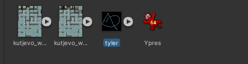
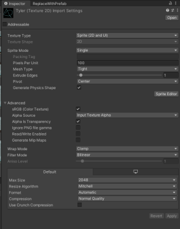
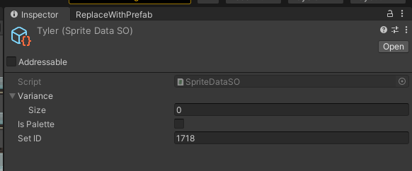
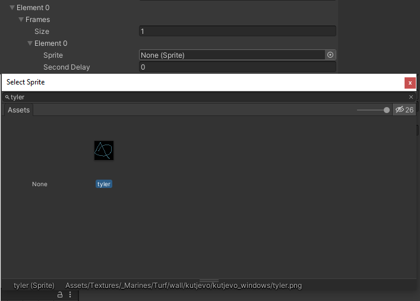
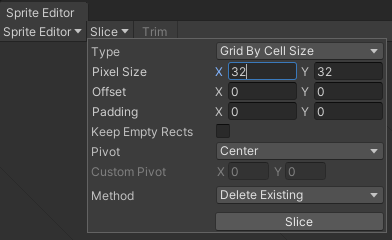
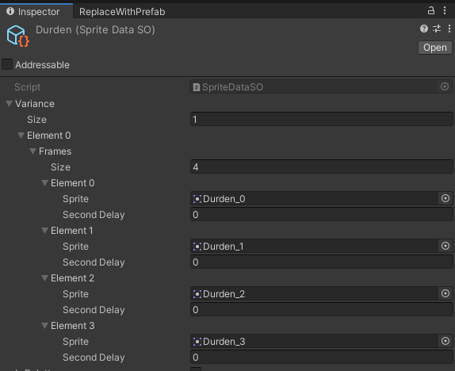
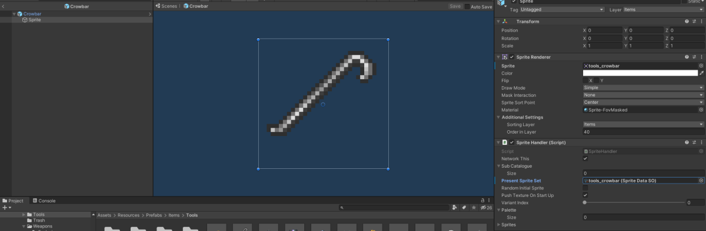
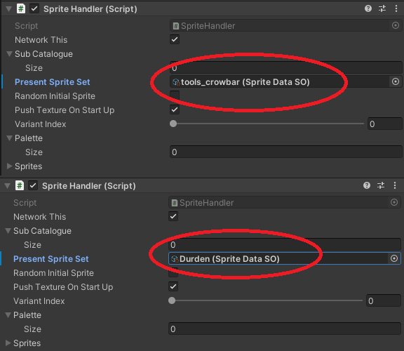

# How to Sprite

## How to make and import sprites using Singleton Scriptable Objects 

Firstly, draw your image in a photoshop program and save it as a png file. Relocate the file to the particular sub Sprite Folder, then navigate to the folder location in the editor.

For the purposes of this document, we are going to use a mock image, the steps will be the same as when you do it for your sprite.

### Single Frame Sprite



Here is Tyler, the Single Frame png file which has just been added into the project. His settings are not yet optimised, to optimise them open him up in the inspector, like so.



Now make the following adjustments:

- Change **Pixels Per Unit** to **32**
- Change **Mesh Type** to **Full Rect**
- Tick **Read/Write Enabled** so it is true
- Set **Filter Mode** to **Point (no filter)**
- Set the **Format** to **RGBA 32 bit** in the **Default** tab

Now the image is ready to put into the Singleton Scriptable Object. Right Click up top on the white bar and go **Create** -> **Singleton Scriptable Object** -> **SpriteData**.

Make sure the names between your sprite and SO match. Open up the newly created SO in the inspector like so:



Now make the following adjustments (in order):

1. Set **Variance** from 0 to 1
1. Inside **Element 0** subtab in **Frames** set size from 0 to 1
1. Now inside the **Frame's** **Element 0** there should be an entry called **Sprite**, click on the cricle to the right and search for your sprite. Click and hit enter to make sure you actually select it, it can be a bit temperamental.



To add your sprite to the repository, commit and PR these files to git, make sure you are looking to commit your files and not any tyler images.

- tyler.asset
- tyler.asset.meta
- tyler.png
- tyler.png.meta
- SpriteCatalogueSingleton

###  Multi Frame Sprite

This is for using a sprite sheet to make an animations or have different holding positions for in-hand item etc. All the usual adjustments from Single Frame Sprite above apply to the Durden image. However, make sure that the **Sprite Mode** set to **Multiple** instead of Single in the inspector.


Now click on the **Sprite Editor** button in the bottom right hand corner, it's time to slice the sprite sheet up. 



In top left click **Slice**, then set **Type** to **Grid by Cell Size** and then make sure that **Pixel Size** is adjusted so that you get the dimensions you want for the sprite (e.g. if it's 32 by 32, then set both X and Y to 32). There should now be squares around each sprite, however it is not saved until you press the **Apply** button in the top right.



Now when you create the Singleton Scriptable Object for Sprite Data this time, put in the number of frames that you sliced up in **Variance** -> **Element0** -> **Size**. To set the delay between the frames, you need to add the total delay otherwise the frames will appear on top of each other - so if you want a 1 second delay between each frame you set each element to be 1, 2 (1+1), 3 (2+1) and 4 (3+1).

## Changing your sprite

To control your sprite in your code, you must first create the sprite object as a child of the object you want to use the sprite for. To demonstrate, we will go into the crowbar object and double click to bring up the prefab and all it's children.



If you change the **Present Sprite Set** to durden



It will now show your Durden sprite. From this point, you can change the present sprite by calling ```baseSpriteHandler.ChangeSprite(Variable)```, where **Variable** is an enum state (e.g. SpriteState.Idle) to which will allow you to change your Multi-Frame sprite. You can also change variants if you need to modify its orientation by calling ```baseSpriteHandler.ChangeSpriteVariant(Variable)```, where Variable is again a number.

## How to make and import paletteable sprites 

This guide will help you make sprites that have their colors defined by a palette that can be altered at runtime. This guide was written earlier in development, it is still useable, but not recommended to be used if you are not yet comfortable with importing sprites. Please use the above method.

Even if you are starting with an ordinary sprite sheet, the process is more of an art than a science. 
That being said, with some practice the results are very neat:


With this system it could be possible to code dyes, paints, spells, or other features that change the color of objects in the middle of the game!

Note: At time of writing, this system is only confirmed to work with items which make use of the `ItemAttributesV2` script.

## Creating the paletteable sprite texture

The colors of a paletteable sprite indicate which swatches of the palette to blend together and how to blend them. 
So, in their unshaded form, they look almost nothing like what the results might produce. 
Understandably, it would be difficult to create something like this using an ordinary image editor. 
With that in mind, a custom image editing tool has been made to work with this format. 

It is a web tool available in ``Tools/paletteable sprite editor/``:


### Features of the tool
On the top is where a paletteable sprite can be loaded in for previewing or editing. In fact, any image can be loaded here and that is very useful for converting an ordinary sprite into a paletteable one.

In the upper-left is the palette manager for the tool. 

* Select the palette colors by clicking on the colored boxes.

* Determine which palette swatches the cursor will draw from by selecting swatches for A and B.

* Determine how the A and B swatches are blended for drawing with the cursor by moving the slider left and right

* The color next to the slider provides a preview of the color that the cursor will draw

* Add and remove swatches 


In the lower-left are some actual-size preview panes. 

* The top image under **Preview** shows what the paletteable sprite currently in the canvas will produce with the colors currently selected in the palette.

* The lower image under **Paletted** shows what the paletteable sprite looks like in its raw form. This is used to export the sprite from the tool by right-clicking and saving the image to disk.

### Typical workflow of using the tool

Suppose we want to make this ordinary sprite sheet into being paletteable:


1. Optional: Load a sprite into the editor by browsing for the sprite and clicking `Load Raw` at the top. 

    * This can be an ordinary or a palettable sprite, although an ordinary sprite will not look as expected in the canvas of the tool. Loading an ordinary sprite can still be useful because you can trace the shape of the sprite, so if you choose that. You will want to open the original in another window.

    * If loading in a paletteable sprite for editing, **be sure to add or remove swatches so that the palette size is correct *before* loading the sprite!**


Note: In the case of large sprites, you may need to slice them up to get them to fit into the canvas of the tool.

2. Add, remove and edit the colors in the palette to be ones that you think describe the object. 
For the best effect, colors that should always a blend of two other colors should not be their own palette color, because the blending should take care of that. 
For instance, in a grey jumpsuit, you might have a medium grey for the main color of the clothing, black for the shadows, black for the dark part of the belt, and white for the belt buckle.

This step is very much up to artistic interpretation.


3. Use the slider to mix the swatches to make the colors you'd like to paint. Left-click in the canvas to draw a pixel. Right-click in the canvas to remove a pixel. If a pixel refuses to paint when left-clicked try right-clicking first to remove it (known bug).

For example, suppose swatch 0 is white and swatch 1 is black. 
If you want to paint grey because it is a blend of those colors, you can set A to swatch 0 and B to swatch 1 and blend as appropriate. 
If you want to paint white, you can set A or B (or both) to swatch 0 and set the blend level appropriately.


4. When you want to check that your work is going well, it is recommended to change the palette colors to different values to 
verify that the blending works as expected. 
You might realize that it would make sense to combine two colors into one swatch or to make one swatch into two to allow for more control.


5. Once you are done editing the sprite, you can export it by right-clicking into the **Paletted** image pane in the lower-left and
saving it to disk. 

Note: The editor does not support alpha editing, every pixel is either 0% or 100% opaque. 
This is a quirk of the editor, the paletting shader fully supports alpha in the sprites. 
Consider using an external image editor to apply alpha as needed. (Or, making a better editor 😉)

## I have a paletteable sprite texture. Now what?

It takes a few steps to import it, set the palette colors, and tell the various bits to use the palette.

1. First, load the texture into unity and slice it into sprites as you would any sprite.
2. Apply the new sprite to the SpriteDataSO(s) for the item you would like.
3. Enable the checkbox(es) for `Is Palette` in the SpriteDataSO(s).
4. If the item is clothing, find the item's Clothing Data and set the palette size and colors there and enable the checkbox for `Is Paletted`.
5. Go into the prefab of the item with `Item Attributes V2` And set the palette size and colors there, and also check `Is Paletted`. 
   * In the `Sprite` child(ren) of the object, set the size and colors of `Palette`.

### Dev notes 

* The general idea is that each instance of an item can have a distict selection of colors for its palette. This is the rationale behind having a palette on `Item Attributes V2`. However, the sprite handler currently manages its own palette drawn in most cases from sprite SO. A good improvement would be to draw from the sprite SO or clothingData (or other sources of a "default" palette, and then allow the `ItemAttributes V2` palette to override it. 
* Various rendering components need access to the palette to apply it to the shader they control. Search for `_ColorPalette` to see where this occurs.
* It would be convenient for changes to propagate from the `Item Attributes V2` of the instance to the spriteHandlers associated with the item. Currently, there is a right-click menu for `Item Attributes V2` which once used to propagate them starting in `PropagatePaletteChanges` but it has since broken (and even then, it only worked for Clothes). Making that work completely again may be a welcome fix.

## How the shader works

For each pixel:

* R component is used to select the index of swatch A. 0-31 => swatch 0, 32-63 => swatch 1, etc.
* G component is used to select the index of swatch B.
* B component is used to lerp from the color of A to the color of B in RGB color space. 0 => 100% A, 128 => 50% - 50%, 255 => 100% B.
* A component is used directly for the alpha of the output.

The shader currently only works with a palette length of exactly 8 but it could in theory work with 256 colors. There are a few magic number 8s that would need to be changed as well to increase the palette size and/or make it dynamic.
