#Projectiles

## Introduction to bullets

Find bullet folder:


Click on a bullet prefab that's what you will see:

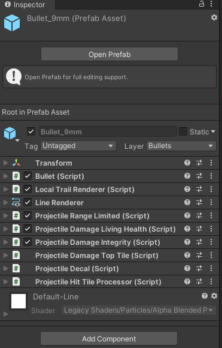

Double click on prefab in the folder or press "Open prefab":

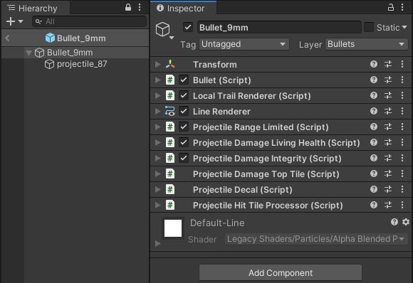

 "Bullet_9mm" with an arrow down is main game object that will have all behavior components on it.
 "projectile_87" is an actual moving game object in the world. It moves in the local space of the "Bullet_9mm".

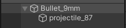

Some bullets in the game emmit light or have a sprite. So if your new bullet requires a following light, you will need to add a new child game object to the moving game object.


"Bullet_9mm" does not have a sprite or a light attached to it, but it uses [**LocalTrailRenderer**](https://github.com/unitystation/unitystation/blob/develop/UnityProject/Assets/Scripts/Weapons/Projectiles/Behaviours/LocalTrailRenderer.cs) component and `LineRenderer`.

[**LocalTrailRenderer**](https://github.com/unitystation/unitystation/blob/develop/UnityProject/Assets/Scripts/Weapons/Projectiles/Behaviours/LocalTrailRenderer.cs) controls drawing in local space.


[**LineRenderer**](https://docs.unity3d.com/Manual/class-LineRenderer.html) is unity built-in component which renders trail.


Positions control how it will be drawn.

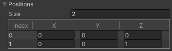

You can change values right there and see how it will look.

 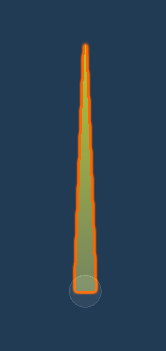

## Projectile behaviours

There are 4 interfaces currently which allow behaviours to control projectile.

### [**IOnShoot**](https://github.com/unitystation/unitystation/blob/develop/UnityProject/Assets/Scripts/Weapons/Projectiles/Behaviours/IOnShoot.cs)

```c#
/// Interface to gather shooter information
/// Used for logs or chat messages
public interface IOnShoot
{
    void OnShoot(Vector2 direction,
                 GameObject shooter,
                 Gun weapon,
                 BodyPartType targetZone = BodyPartType.Chest);
}
```

- Example [**ProjectileDamageIntegrity**](https://github.com/unitystation/unitystation/blob/develop/UnityProject/Assets/Scripts/Weapons/Projectiles/Behaviours/ProjectileDamageIntegrity.cs):

This script damages collider if it has an [**Integrity**](https://github.com/unitystation/unitystation/blob/develop/UnityProject/Assets/Scripts/Health/Objects/Integrity.cs) component.
But the point is, it caches [**Gun**](https://github.com/unitystation/unitystation/blob/develop/UnityProject/Assets/Scripts/Weapons/Gun.cs) and the shooter by using [**OnShoot**](https://github.com/unitystation/unitystation/blob/develop/UnityProject/Assets/Scripts/Weapons/Projectiles/Behaviours/IOnShoot.cs) so it can print a chat message and log details.
Also don't forget to clear references in [**OnDisable**](https://docs.unity3d.com/ScriptReference/MonoBehaviour.OnDisable.html).

```c#
public class ProjectileDamageIntegrity : MonoBehaviour, IOnShoot, IOnHit
{
    private GameObject shooter;
    private Gun weapon;

    [SerializeField] private DamageData damageData = null;

    public void OnShoot(Vector2 direction, GameObject shooter, Gun weapon, BodyPartType targetZone = BodyPartType.Chest)
    {
        this.shooter = shooter;
        this.weapon = weapon;
    }

    public bool OnHit(RaycastHit2D hit)
    {
        return TryDamage(hit);
    }

    private bool TryDamage(RaycastHit2D hit)
    {
        var coll = hit.collider;
        var integrity = coll.GetComponent<Integrity>();
        if (integrity == null) return false;

        integrity.ApplyDamage(damageData.Damage, damageData.AttackType, damageData.DamageType);

        Chat.AddAttackMsgToChat(shooter, coll.gameObject, BodyPartType.None, weapon.gameObject);
        Logger.LogTraceFormat("Hit {0} for {1} with HealthBehaviour! bullet absorbed", Category.Firearms,
            integrity.gameObject.name, damageData.Damage);

        return true;
    }

    private void OnDisable()
    {
        weapon = null;
        shooter = null;
    }
}
```

### [**IOnMove**](https://github.com/unitystation/unitystation/blob/develop/UnityProject/Assets/Scripts/Weapons/Projectiles/Behaviours/IOnMove.cs)

```c#
/// Called every time projectile moved
/// Basically allows to have behaviors
/// which are called when projectile moves.
public interface IOnMove
{
    bool OnMove(Vector2 traveledDistance);
}
```

- Example is a script which limits projectiles travel distance [**ProjectileRangeLimited**](https://github.com/unitystation/unitystation/blob/develop/UnityProject/Assets/Scripts/Weapons/Projectiles/Behaviours/ProjectileRangeLimited.cs):

When maximum distance is reached, it returns `true` which requests [**Bullet**](https://github.com/unitystation/unitystation/blob/develop/UnityProject/Assets/Scripts/Weapons/Projectiles/Bullet.cs) to despawn itself.
Don't forget to reset data(count in this case) in  [**OnDisable**](https://docs.unity3d.com/ScriptReference/MonoBehaviour.OnDisable.html).

```c#
/// Limits projectiles travel distance
public class ProjectileRangeLimited : MonoBehaviour, IOnMove
{
    [Tooltip("How many tiles it will travel.")]
    [SerializeField] private float maxDistance = 15;
    private float currentDistance;

    public bool OnMove(Vector2 traveledDistance)
    {
        return AddDistance(traveledDistance.magnitude);
    }

    private void OnDisable()
    {
        currentDistance = 0;
    }
```

### [**IOnHit**](https://github.com/unitystation/unitystation/blob/develop/UnityProject/Assets/Scripts/Weapons/Projectiles/Behaviours/IOnHit.cs)

```c#
/// Called when projectiles raycast collides with something
public interface IOnHit
{
    bool OnHit(RaycastHit2D hit);
}
```

- Simple example [**ProjectileDecal**](https://github.com/unitystation/unitystation/blob/develop/UnityProject/Assets/Scripts/Weapons/Projectiles/Behaviours/ProjectileDecal.cs):

This script spawns a decal in the point where bullet hit something.

```c#
public class ProjectileDecal : MonoBehaviour, IOnHit
{
    [SerializeField] private GameObject decal = null;

    [Tooltip("Living time of decal.")]
    [SerializeField] private float animationTime = 0;

    public bool OnHit(RaycastHit2D hit)
    {
        var newDecal = Spawn.ClientPrefab(decal.name,
            hit.point).GameObject;
        var timeLimitedDecal = newDecal.GetComponent<TimeLimitedDecal>();
        timeLimitedDecal.SetUpDecal(animationTime);
        return false;
    }
}
```

### [**IOnDespawn**](https://github.com/unitystation/unitystation/blob/develop/UnityProject/Assets/Scripts/Weapons/Projectiles/Behaviours/IOnDespawn.cs)

```c#
public interface IOnDespawn
{
    /// Interface for notifying components that
    /// game object is about to be despawned
    /// "hit" Collider responsible for despawn, new RaycastHit if nothing was hit
    /// "point" Coordinate where object is about to despawn
    void OnDespawn(RaycastHit2D hit,
                   Vector2 point);
}
```

- Example [**ProjectileAnimateTile**](https://github.com/unitystation/unitystation/blob/develop/UnityProject/Assets/Scripts/Weapons/Projectiles/Behaviours/ProjectileAnimateTile.cs):

This script creates an animated tile.
The behaviour needs to do it once, when bullet is about to be despawned.
So if hit is `null` it will despawn on `point`.

```c#
public class ProjectileAnimateTile : MonoBehaviour, IOnDespawn
{
    [SerializeField] private AnimatedTile animatedTile = null;

    [Tooltip("Living time of animated tile.")]
    [SerializeField] private float animationTime = 0;

    public void OnDespawn(RaycastHit2D hit, Vector2 point)
    {
        if (hit.collider == null)
        {
            OnBeamEnd(point);
        }
        else
        {
            OnCollision(hit);
        }
    }

    private void OnBeamEnd(Vector2 position)
    {
        var interactableTiles = GetComponentInParent<InteractableTiles>();

        interactableTiles.CreateAnimatedTile(position, animatedTile, animationTime);
    }

    private void OnCollision(RaycastHit2D hit)
    {
        var coll = hit.collider;
        var interactableTiles = coll.GetComponentInParent<InteractableTiles>();
        
        // Off setting coordinate here is needed to get exactly what tile was hit
        var bulletHitTarget = Vector3.zero;
        bulletHitTarget.x = hit.point.x - 0.01f * hit.normal.x;
        bulletHitTarget.y = hit.point.y - 0.01f * hit.normal.y;

        interactableTiles.CreateAnimatedTile(bulletHitTarget, animatedTile, animationTime);
    }

}
```

An example of getting those behaviours in [**Awake**](https://github.com/unitystation/unitystation/blob/3f09f64ec56c92e00c37290667cedc42e73e524c/UnityProject/Assets/Scripts/Weapons/Projectiles/Bullet.cs#L25):

Also we cache [**MovingProjectile**](https://github.com/unitystation/unitystation/blob/develop/UnityProject/Assets/Scripts/Weapons/Projectiles/MovingProjectile.cs). Its the child game object we talked about which moves in space.

```c#
public class Bullet : Projectile
{
    private IOnShoot[] behavioursOnShoot;
    private IOnMove[] behavioursOnMove;
    private IOnHit[] behavioursOnBulletHit;
    private IOnDespawn[] behavioursOnBulletDespawn;

    private MovingProjectile movingProjectile;

    private void Awake()
    {
        behavioursOnShoot = GetComponents<IOnShoot>();
        behavioursOnMove = GetComponentsInParent<IOnMove>();
        behavioursOnBulletHit = GetComponents<IOnHit>();
        behavioursOnBulletDespawn = GetComponents<IOnDespawn>();

        movingProjectile = GetComponentInChildren<MovingProjectile>();
    }
```

So how they work and why should you use them?
The behaviour pattern allows you to easily add new game mechanics without touching existing code.

For example:

I want my Bullet to [**STUN**](https://github.com/unitystation/unitystation/blob/develop/UnityProject/Assets/Scripts/Weapons/Projectiles/Behaviours/ProjectileStun.cs)!

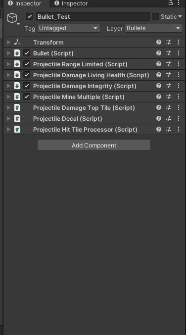

## Creating a [**Projectile**](https://github.com/unitystation/unitystation/blob/develop/UnityProject/Assets/Scripts/Weapons/Projectiles/Projectile.cs)

Check what bullet already has similar idea of what you want. Duplicate it with `ctrl + d`:


Remove game objects you won't need.

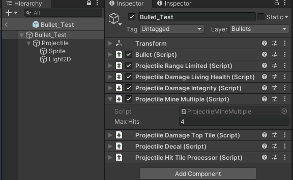

!!! warning
    Make sure the bullet is in the same folder as other bullets.
    There is pooling system which does not despawn bullets but disables them to use later.
    It references this folder.

# Pool

Find pool with bullets:

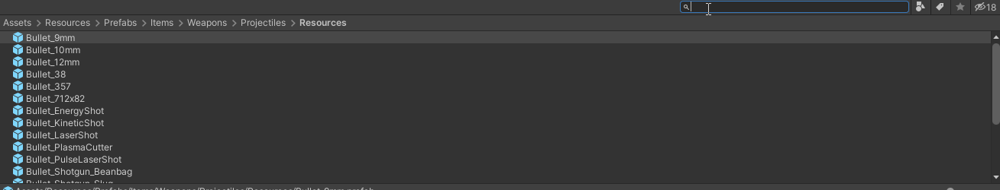

Open the pool SO. Extend elements count.

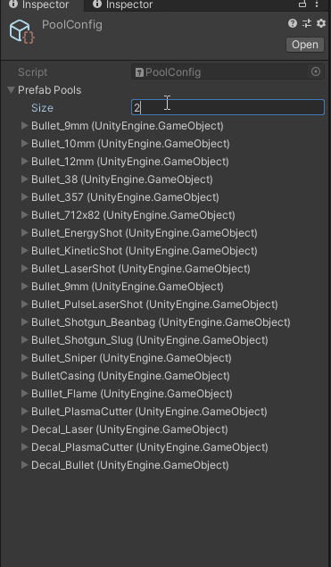

Search for bullet again and drag and drop the prefab into the new created element in the pool list.


## Hit Processor

Open up the [**Bullet**](https://github.com/unitystation/unitystation/blob/develop/UnityProject/Assets/Scripts/Weapons/Projectiles/Bullet.cs) component in the editor.

That's what you will see:

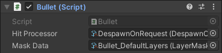

Hit processor is a [**Scriptable Objects**](https://docs.unity3d.com/Manual/class-ScriptableObject.html) which iterates through all components which are inheriting from `IOnHit` behaviour interface.

Example [**DespawnOnHit**](https://github.com/unitystation/unitystation/blob/develop/UnityProject/Assets/Scripts/ScriptableObject/Gun/DespawnOnHit.cs):

This processor iterates through all behaviours and then always returns `true`. When it returns `true` [**Bullet**](https://github.com/unitystation/unitystation/blob/develop/UnityProject/Assets/Scripts/Weapons/Projectiles/Bullet.cs) despawns the game object.

```c#
public class DespawnOnHit : HitProcessor
{
    public override bool ProcessHit(RaycastHit2D hit, IOnHit[] behavioursOnBulletHit)
    {
        foreach (var behaviour in behavioursOnBulletHit)
        {
            behaviour.OnHit(hit);
        }

        return true;
    }
}
```

This is a simplest processor you will get.

Another Example [**DespawnOnRequest**](https://github.com/unitystation/unitystation/blob/develop/UnityProject/Assets/Scripts/ScriptableObject/Gun/DespawnOnRequest.cs):

This one will only return `true` if any behaviour returns `true`.

```c#
public class DespawnOnRequest : HitProcessor
{
    public override bool ProcessHit(RaycastHit2D hit, IOnHit[] behavioursOnBulletHit)
    {
        var isRequesting = false;
        foreach (var behaviour in behavioursOnBulletHit)
        {
            if (behaviour.OnHit(hit))
            {
                isRequesting = true;
            }
        }

        return isRequesting;
    }
}
```

So if creating a new projectile you need to process your behaviours in a special way, you will need to
create a `class` and inherit from [**HitProcessor**](https://github.com/unitystation/unitystation/blob/develop/UnityProject/Assets/Scripts/ScriptableObject/Gun/HitProcessor.cs).Write up logic you need and return `true` when you want bullet to be despawned.
    
!!! Tip
    Make sure you write `[CreateAssetMenu(fileName = "DespawnOnRequest", menuName = "ScriptableObjects/Gun/DespawnOnRequest", order = 0)]` above your class.
    It will allow you to create this processor in unity so you can reference it in the `Bullet` component.
    
## Mask Data

Contains layers which `Raycast` will hit. So if you don't have `Walls` layer specified for example, the bullets `Raycast` won't detect the that it hit the wall when colliding it which will result in returning `null` `RaycastHit`.

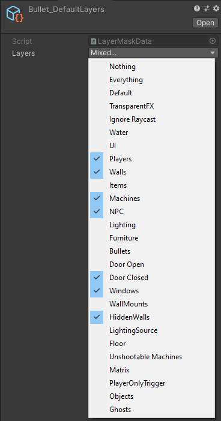

If you need your own data for the bullet, right click in this folder:

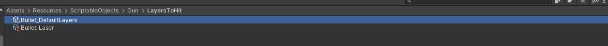

And follow those steps:

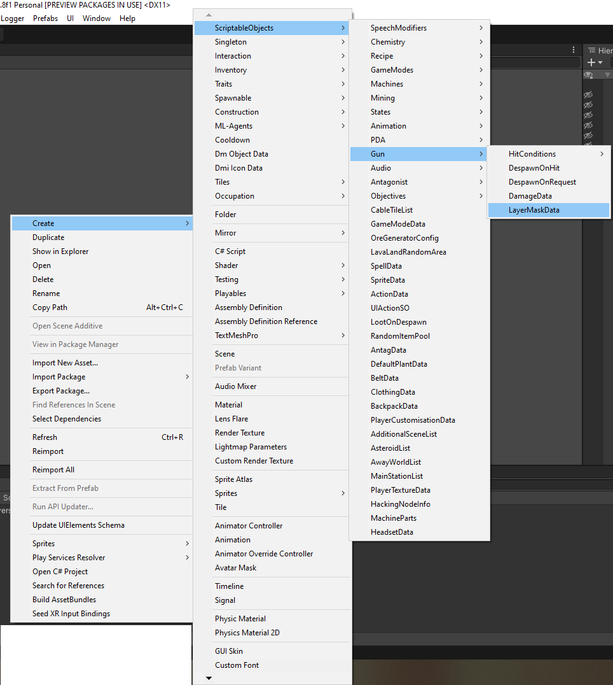

This will create [**Scriptable Objects**](https://docs.unity3d.com/Manual/class-ScriptableObject.html) with layer data which you can specify for your own needs and then reference in your bullet.

Also using [**Scriptable Objects**](https://docs.unity3d.com/Manual/class-ScriptableObject.html) allows you to change layers right in play mode, so feel free to experiment right in game.
