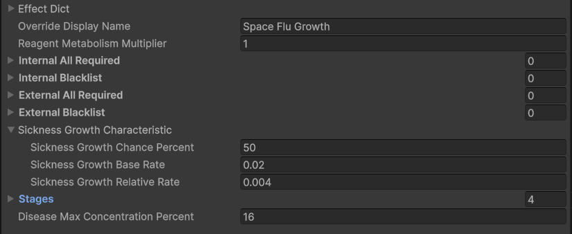
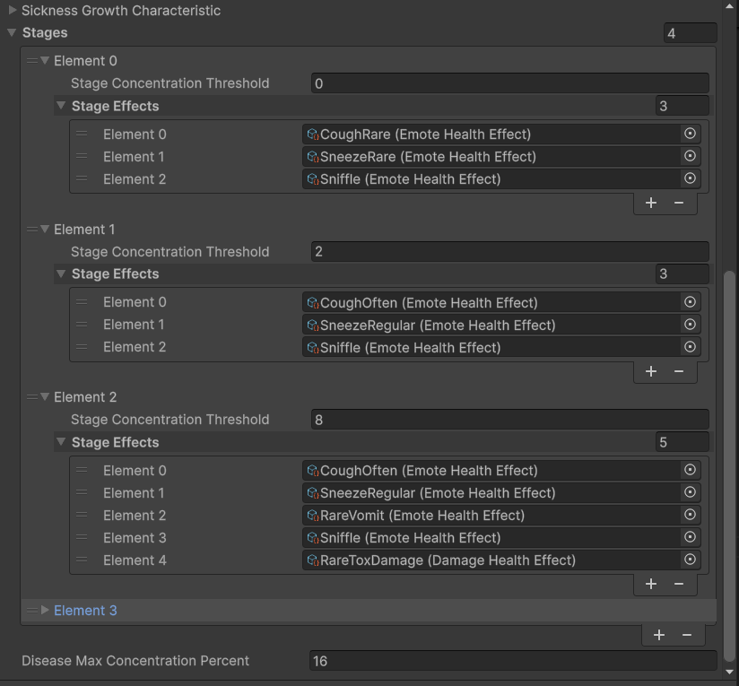
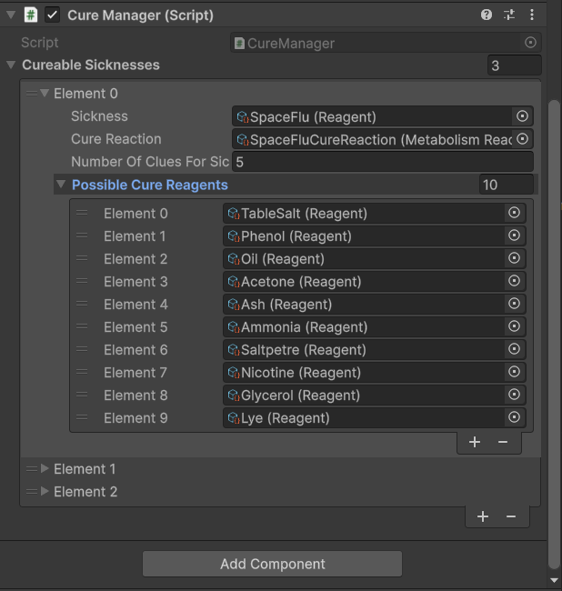
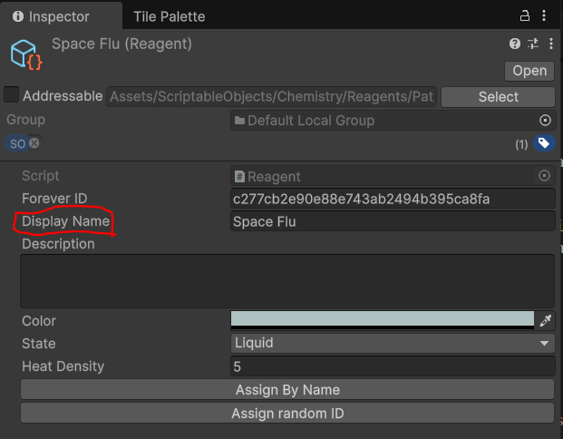
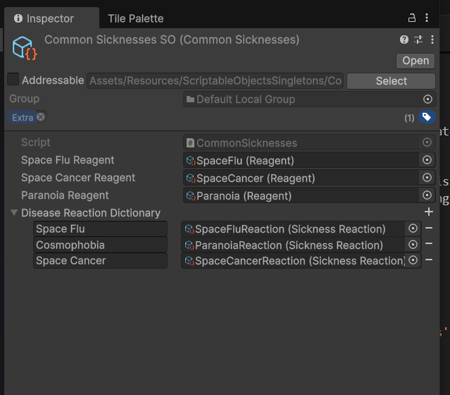
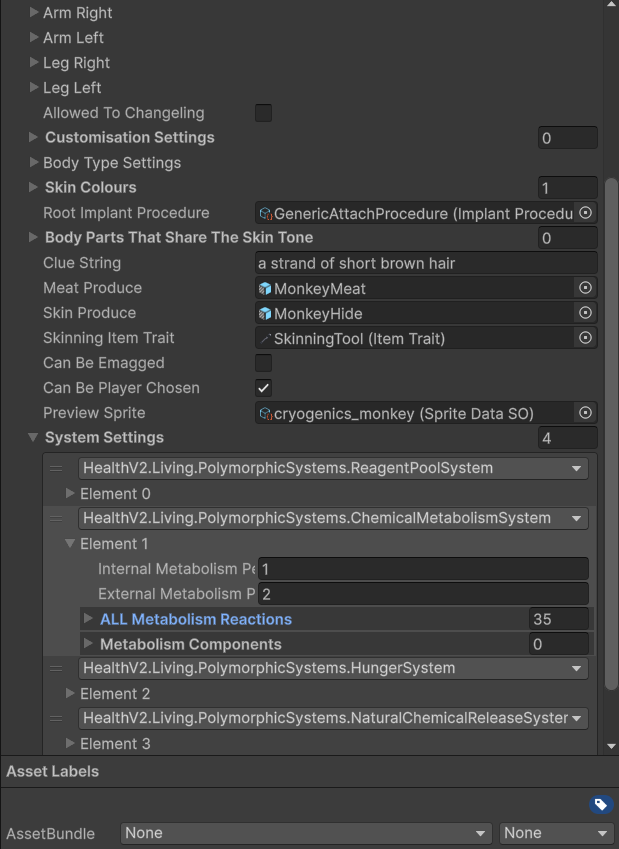

# Unitystation Sickness - How to implement new sicknesses

In Unitystation, sicknesses are reagents (chemicals) and use unitystations chemistry system to perform their functions and afflict the player.
This page covers the process for implementing new sicknesses into the game.

# Creating Resources

In order to add a sickness, three new files must be created:

- The sickness reagent itself. Create a new reagent by right clicking in the asset window and navigating to `Create -> ScriptableObjects/Chemistry/Reagent`
- A sickness growth reaction. This chemical reaction denotes how the sickness should grow within a patient and what symptoms to afflict. We will cover this in detail later, but to create one, right click in the asset window and navigate to `Create -> ScriptableObjects/Chemistry/SicknessReaction`
- A sickness cure reaction. This chemical reaction controls how the sickness is cured. The contents of this reaction are generated at runtime but we need a place for these contents to be written. Create a cure reaction by creating a simple reaction (`Create -> ScriptableObjects/Chemistry/Reaction`) and ensure all fields are empty.

When creating new scriptable objects, please respect existing file structure. The folders for each of the above resources are so:
`Assets/ScriptableObjects/Chemistry/Reagents/Pathogens`
`Assets/ScriptableObjects/Chemistry/Reactions/Sicknesses`
`Assets/ScriptableObjects/Chemistry/Reactions/Sicknesses`

# Defining your disease

The behaviour of a sickness is determined by its growth reaction. 
To start, ensure your pathogen reagent is the sole ingredient on your growth reaction.
Lets look at how to customise your sickness:


# Growth Characteristics
Growth characteristics describe how your sickness will grow or shrink over time and are edited on the growth reaction SO as seen below:



Growth characteristics are divided into 3 parts:

- **Sickness Growth Chance Percent**
  The chance in % that the sickness will attempt to grow each metabolism update. This is the easiest way to quickly change the rate of growth and typically varies between 40%-60%

- **Sickness Growth Base Rate**
  This is a flat amount of pathogen that is always added to the system if the reagent is present. The standard bloodpool of a human is 500u of reagent, and standard sicknesses will grow until they occupy 16% of said bloodpool or rougly 100u of pathogen. As seen in the example, this base rate is very small, 0.02u per update. The idea of the base rate is to get a sickness going when a small amount (from a cough/sneeze etc) enters the players body.

- **Sickness Growth Relative Rate**
  The sickness growth relative rate is a multiplier for the current pathogen amount that is applied every sucessful growth attempt. The exact method is so:
  ```cs 
  NewPathogenAmount = OldPathogenAmount * (1 + SicknessGrowthRelativeRate). 
  ```


The base and relative rates shown in the image above are precisely callibrated using a simulation to obtain the desired growth, as such, unless you know what you are doing it is not recommended to change the base and relative rate for your disease. If you wish to change how fast your sickness grows, just tinker with the chance %.

At the bottom of your growth reaction SO there is one last field;

- **Disease Max Concentration Percent**
  This controls the maximum %age this disease can occupy in the victims blood stream. This is by default 16%. Increasing it much further beyond this point can result in erratic behaviour involving other health systems so it is not recommended.

# Symptoms and Stages
Diseases are divded into stages each with afflict their own independent symptoms. The current stage of a disease is controlled by its %age occupation of the hosts blood stream. Your disease may have as many or as few stages as needed.

The fields for configuring these stages are seen below:


- **Stage Concentration Threshold**
  The minimum %age this disease must occupy in the victims bloodstream in order for this stage to apply.

- **Stage Effects**
  A list of chemistry effects that will *always* be triggered during this stage. During each update, all symptoms in this list will be triggered. If the symptom should only have a chance to occur (such as an emote like a cough), the chance must be implemented on the effect side.
  If you wish for the symptom to be an emote, damage, or heal, please use existing the SOs:
  `ScriptableObjects/Chemistry/BodyHealthEffect` & `ScriptableObjects/Chemistry/EmoteHealthEffect`

  Existing symptoms may be found in the `ScriptableObjects/Chemistry/Effects/Sickness` folder. Add your symptoms into this folder aswell.


# Setting up Cures
In order for your disease to be curable and work with other systems, it must be configured in the cure manager.
Open up the cure manager prefab via: `Assets/Prefabs/SceneConstruction/NestedManagers/CureManager.prefab`
On the prefab we are looking at the CureManager component shown below:


Add an entry for your disease.
- **Sickness**
  Your created pathogen reagent

- **Cure Reaction**
  The blank cure reaction you created for your pathogen.

- **Number of Clues for Sickness**
  The number of possible reagents given by the sequence analyzer when someone analyzes your disease. The more clues, the harder to cure. 5 is easy, 6 moderate, etc.

- **Possible Cure Reagents**
  A list of reagents that can possibly be the cure for your pathogen. Ensure that reagents on this list do not already have reactions with each other as this will cause them to react with themselves instead of curing, leading to a possible uncurable disease. Unless unique chemicals are needed to cure your sickness, copying an existing list from another sickness is recommended.


# Finishing up
Now our sickness is defined, the last thing to do is to add nessacary references to existing managers and singletons.

First, open up the ChemistryReagentSO -> `Assets/Resources/ScriptableObjectsSingletons/ChemistryReagentsSO.asset`
Press `Collect All Reagents` and `Collect All Reactions` to add your created resources to the singleton. Then press `Fix reagents' indexes` & `Fix reactions' indexes` to fix any possible index errors from added the new resources.

Next, open up the CommonSicknessSO: `Assets/Resources/ScriptableObjectsSingletons/CommonSicknessesSO`
Add a new entry to the disease reaction dictionary. 
The Key is the display name for your pathogen reagent, the value its growth reaction. This dictionary is used to network latejoins so ensure this step is complete.
The display name for your pathogen can be found on the pathogen reagent SO.



The other fields in CommonSicknesses allow systems to access specific dieases without requiring their own serialized reference, i.e
```cs
Reagent sickness = CommonSicknesses.Instance.SpaceFluReagent
```
This is not required for your disease to function, but consider adding a field for your sickness should it needed to be reference by other systems (particuarly those that might not have a gameObject or SO attached).

Lastly, your created Cure & Growth reactions must be added to the metabolism reaction set of species that you wish to catch your disease.
Open up the PlayerHealthData SO for a species that can catch your disease (Found in `Assets/Prefabs/Player/Resources/BodyParts`), open up the system settings for its chemical metabolism system (A species must have this system to catch diseases) and edit the metabolism reaction list.

